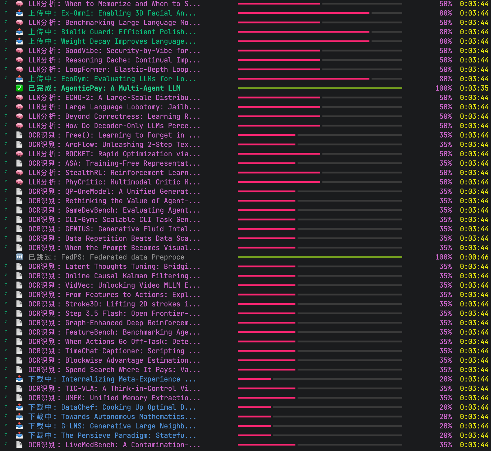

# DailyPapers

🤖 自动抓取 HuggingFace Daily Papers，通过 AI 智能筛选、深度分析并同步到 Zotero 的论文管理工具。



## ✨ 功能特性

- **自动抓取**: 每日自动从 HuggingFace Daily Papers 获取最新论文
- **AI 智能筛选**: 基于个人研究兴趣，使用 LLM 自动筛选感兴趣的论文
- **智能分类**: 根据 Zotero 现有目录结构，自动将论文归类到合适文件夹
- **深度分析**: 支持 PDF OCR 识别、图表提取、核心内容分析
- **批次汇总**: 自动对论文进行批次汇总，生成每日科研情报报告
- **流水线处理**: 筛选→下载→OCR→LLM分析 全流程异步流水线
- **Zotero 同步**: 自动上传论文 PDF、阅读笔记到 Zotero
- **本地备份**: 同时保存到本地指定目录，支持网盘同步
- **重试机制**: PDF下载、OCR识别、LLM分析均支持自动重试

## 🚀 快速开始

### 1. 安装依赖

```bash
pip install -r requirements.txt
```

### 2. 配置

复制配置模板并修改：

```bash
cp config.yaml.example config.yaml
```

编辑 `config.yaml`：

```yaml
# Zotero 配置
zotero:
  library_id: 'YOUR_LIBRARY_ID'
  library_type: 'user'
  api_key: 'YOUR_ZOTERO_API_KEY'
  collection_id: ''  # 可选：指定 Collection ID

# OpenAI 配置（用于论文筛选和分析）
openai:
  api_key: 'YOUR_OPENAI_API_KEY'
  base_url: 'https://api.openai.com/v1'
  model: 'gpt-4'
  timeout: 60
  max_retries: 3
  retry_delay: 5

# DeepSeek OCR 配置（用于论文深度分析）
deepseek_ocr:
  api_key: 'YOUR_DEEPSEEK_API_KEY'
  base_url: 'https://api.deepseek.com/v1'
  model: 'deepseek-ocr'
  timeout: 120
  max_retries: 3
  retry_delay: 5

# 本地存储配置
local_storage:
  base_dir: '/path/to/your/papers'

# 深度分析配置
analysis:
  pdf_dpi: 200              # PDF转图片分辨率
  max_pages: 20             # 每篇论文最大处理页数
  save_visualization: true  # 保存OCR可视化结果
  save_cropped_figures: true
  max_ocr_text_length: 12000
  max_figures_per_paper: 4  # 每篇论文最多选择图表数
  max_figures_in_daily: 6   # 日报中最多展示图表数

# 并发配置（流水线各阶段独立控制）
concurrency:
  paper_workers: 4    # 筛选并发数
  ocr_workers: 4      # OCR并发数
  llm_workers: 4      # LLM分析并发数
  pdf_workers: 10     # PDF下载并发数
  arxiv_chunk_size: 10
  arxiv_delay: 3

# 批次汇总配置
batch_summary:
  batch_size: 10      # 每批汇总的论文数量
  enabled: true

# 筛选偏好
preferences:
  interest: >
    你的研究兴趣，例如：Large Language Models, 
    Multimodal Learning, Computer Vision...
  ignore: >
    你不想看的方向，例如：Pure Text-to-Image generation...
```

### 3. 运行

```bash
# 抓取今天的论文（完整流程：筛选→下载→OCR→分析→汇总）
python main.py

# 抓取指定日期的论文
python main.py --date 2024-01-15

# 跳过深度分析（仅做筛选和下载）
python main.py --skip-deep-analysis
```

## 🔧 代理配置

如果你的网络需要代理，设置环境变量：

```bash
export http_proxy=http://127.0.0.1:7890
export https_proxy=http://127.0.0.1:7890
python main.py
```

## 📁 项目结构

```
DailyPapers/
├── main.py                 # 主程序入口
├── config.yaml             # 配置文件（需自行创建）
├── config.yaml.example     # 配置模板
├── requirements.txt        # 依赖列表
├── images/                 # 截图和文档图片
│   └── image1.png
├── src/
│   ├── hf_scraper.py       # HuggingFace 论文抓取
│   ├── llm_agent.py        # AI 分析模块（含批次汇总）
│   ├── paper_analyzer.py   # PDF深度分析（OCR+图表提取）
│   ├── zotero_ops.py       # Zotero 操作
│   └── utils.py            # 工具函数
└── papers/                 # 本地论文存储目录（按日期组织）
    └── 2024-01-15/
        ├── 00_Daily_Report_CN.md    # 每日汇总报告
        ├── LLM/                     # 分类目录
        │   └── Author_Title/
        │       ├── paper.pdf
        │       ├── note.md          # 详细阅读笔记
        │       └── figures/         # 提取的图表
        └── Vision/
            └── ...
```

## 📝 配置说明

### Zotero API Key 获取

1. 登录 [Zotero](https://www.zotero.org/)
2. 进入 [Settings → Feeds/API](https://www.zotero.org/settings/keys)
3. 创建新密钥，勾选读写权限
4. 获取 Library ID：在 [Settings → User ID](https://www.zotero.org/settings/keys) 页面

### 研究兴趣配置

在 `config.yaml` 的 `preferences` 部分：

- `interest`: 你感兴趣的研究方向，AI 会优先筛选这些论文
- `ignore`: 你不想看的方向，AI 会自动过滤

支持自然语言描述，越详细筛选效果越好。

### DeepSeek OCR 配置

如需启用 PDF 深度分析功能，需要配置 DeepSeek OCR：

1. 获取 DeepSeek API Key：[DeepSeek 开放平台](https://platform.deepseek.com/)
2. 在 `config.yaml` 中配置 `deepseek_ocr` 部分
3. 深度分析会自动提取论文图表、生成中文阅读笔记

### 并发配置说明

流水线各阶段独立控制并发数：

- `paper_workers`: 论文筛选并发（LLM 调用）
- `ocr_workers`: OCR 识别并发（PDF 转图片 + OCR）
- `llm_workers`: LLM 分析并发（基于 OCR 结果生成笔记）
- `pdf_workers`: PDF 下载并发

各阶段独立运行，形成真正的流水线处理。

## ⚠️ 注意事项

- **API 限制**: Zotero API 有速率限制，大量论文请分批处理
- **Token 消耗**: 深度分析会消耗较多 LLM Token，请注意成本控制
- **存储空间**: 请确保本地存储目录有足够空间（每篇论文约 5-20MB）
- **网络代理**: 如需要代理访问，请设置 `http_proxy` 和 `https_proxy` 环境变量
- **版权问题**: 请遵守论文版权，仅用于个人学习研究

## 🤝 贡献

欢迎提交 Issue 和 PR！

## 📄 License

MIT License
